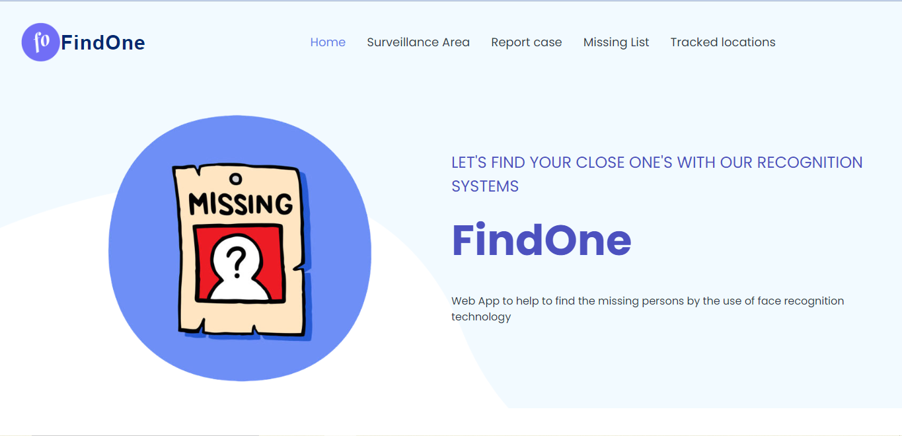
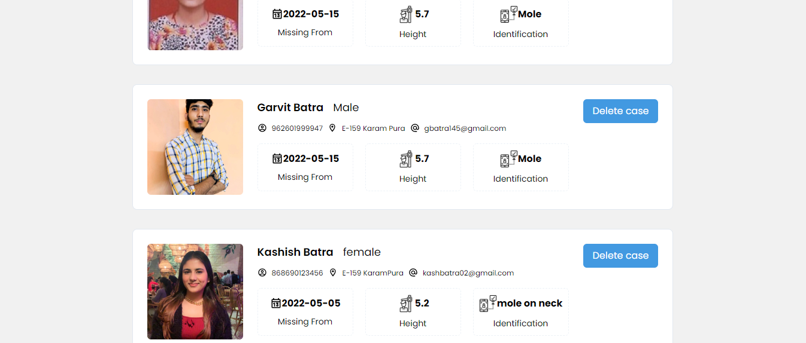
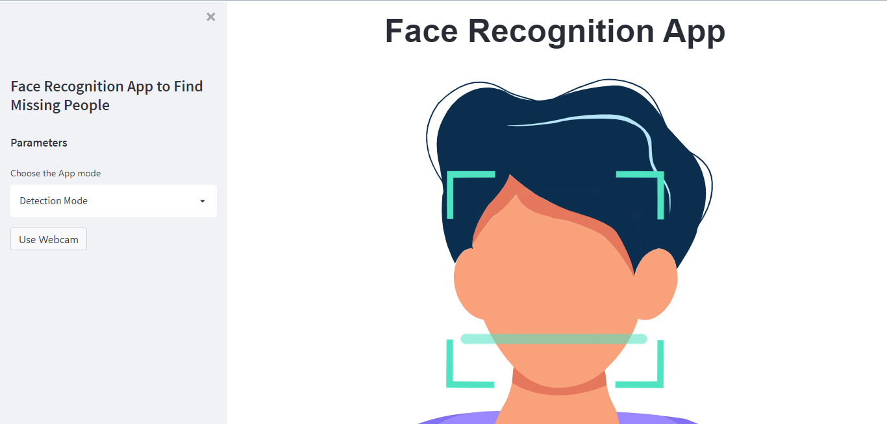
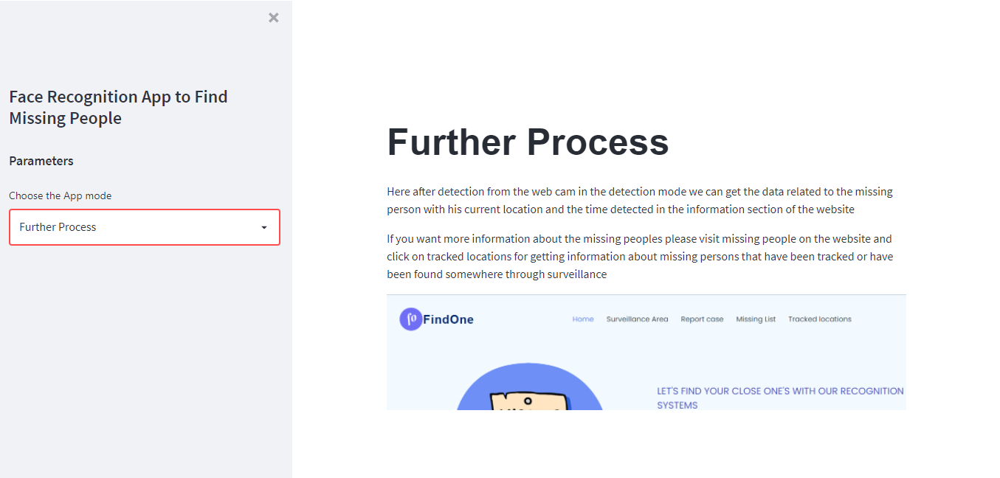
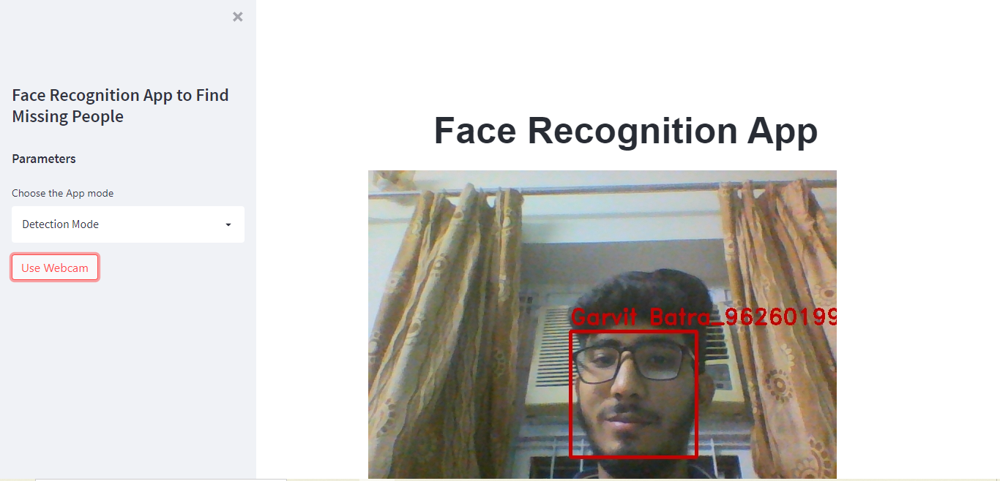
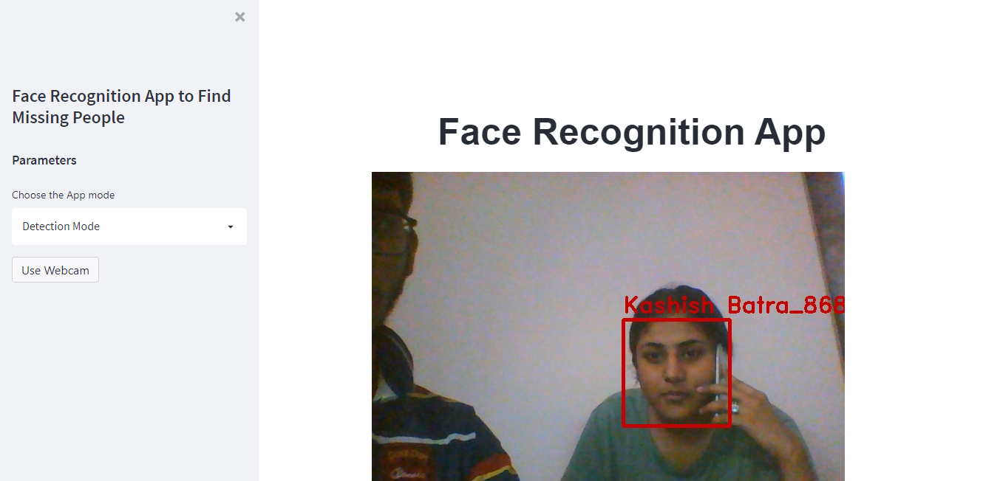

## Table of Contents
1. [General Info](#general-info)
2. [Live Demo](#live-demo)
3. [Technologies](#technologies)
4. [Installation](#installation)
5. [Features](#features)
### General Info
***
This web app is an online portal that enables users to register their close ones which are missing and provides interface to see their movement activities that has been tracked through our face recognition surveillance. It shows all the missing people with their images which has been reported by the stakeholder.  Agile Methodology was used for building this project. The best Agile practices adopted were :

* Proper Planning
* Keeping Product Backlog
* Maintaining a SPRINT Burndown and a Product Burndown.
* Adopting the concepts of relative estimation and velocity.


## Live Demo 
***


* Documentation Link: https://drive.google.com/file/d/1BU0SRQpA34_FoaBTm4EeScGzy8bp9Bzk/view?usp=sharing
* Demo Video: https://youtu.be/DLSFxclC47w

## 


### Screenshots
* Home Page



* Add missing person

 

* Missing people list



* Tracked locations of missing people and search option


* Initial UI for Survillence area



* Further process Mode to show further process how to take actions



* Working screenshots while detecting face





* Whatsapp message recieved simulataneously after locations have been tracked


## Technologies
***
A list of technologies used within the project:
* Face recognition
* Whatsapp API
* Node.js
* Express
* Open CV
* MongoDB
* React
* Tailwind CSS

## Installation
***
A little intro about the installation. 
```
$ git clone https://github.com/garvitbatra02/Face_recognition_Finding_missing_people

```
In Node-js server MS
```
$ npm install
$ node index.js

```
In face_recognition 
```
$ pip install virtualenv
$ virtualenv <my_env_name>
$ source <my_env_name>/bin/activate
$ pip install -r requirements.txt
$ streamlit run main.py

```
In Frontend/frontend MS/msfrontend 
```
$ npm install
$ npm start

```


## Features
***
FindOne features:
* Interactive UI to show missing people
* Real Time environment analysis to detect faces
* Quick and fast Node js backend to support quick response of user detection to database
* Less image degradation due to base64 transfer of image
* Easy to operate missing people data
* Show Time Stamp when a person detacted
* Show accurate location of the person with longitude and latitude pointers
* Pop up Notification of Whatsapp to registered stakeholder mobile number within microseonds

* Search all locations of particular person by adhaar card
## 


## Mordern World Applications


* How many people go missing each year?  

    Missing people: of the 170,000 people reported missing nearly 98,000 are adults and more than 70,000 are children  
    Missing incidents: of the 353,000 reported incidents, more than 137,000 incidents are adults and almost 215,000 incidents are children  
    Looked after children are at high risk of being reported missing. 1 in 10 looked after children are reported missing compared to 1 in 200 children. Looked after children who are reported missing will be reported on average 6 times  

* The number of cases shown above is quite large thus resolving each case is practically impossible by human.
* Hence morden technology of face recognition used here can be used to detect missing people and computer vision makes it easy than human effort.
* Here high accuracy of computer vision and machine learning algorithms has more accuracy than any human memory and eyes.
* This system can be easily installed in CCTV cameras and 24/7 surveillance can be carried out
* Further more integerations can be done like multiple models like a person has a particular marks on body due to disease which could also be recognized easiely.
* This model can also be extended or modified to catch criminals .
* It can also be installed in wildlife regions for detecting rare animal species and extinct ones since it is not safe for human to remain everywhere to capture them.
* It can also be used by companies to detect hoarding overlayed in cities to determine density of advertisement.

## 
